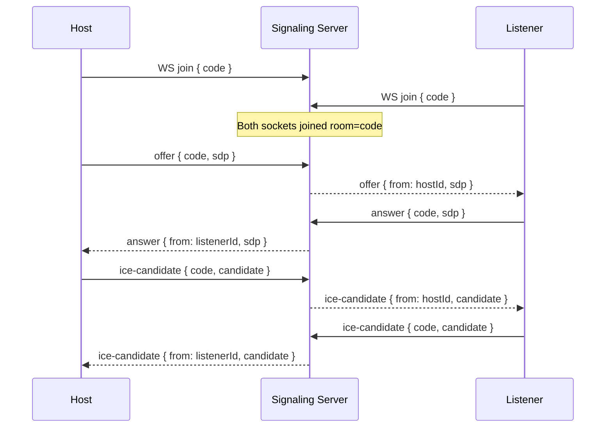

# WebRTC Signaling Flows

## REST Endpoints
- POST `/api/session/create` → `{ code, expiresIn }`
- POST `/api/session/join` → `{ ok: true }`
- POST `/api/session/leave` → `{ ok: true }`

## Room & TTL
- Room name equals 6-digit `code`.
- TTL: 30 minutes refreshed on join.
